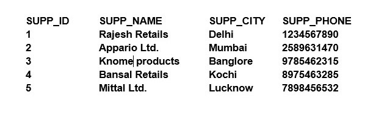
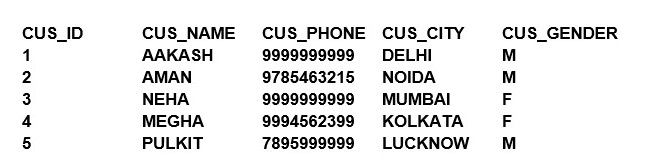
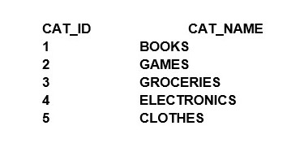
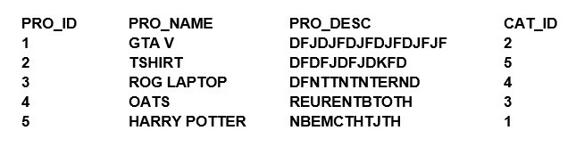
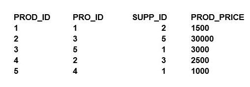
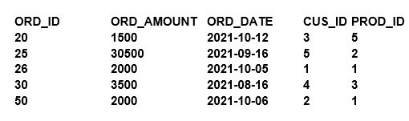
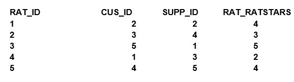

# PratviShah_Lab_DBMS-AssignmentSolution
## Problem Statement [MARKS: 20]

An E-commerce website manages its data in the form of various tables.

1)	You are required to create tables for supplier,customer,category,product,productDetails,order,rating to store the data for the E-commerce with the schema definition given below.
>Supplier(SUPP_ID,SUPP_NAME,SUPP_CITY,SUPP_PHONE)\
Customer(CUS__ID,CUS_NAME,CUS_PHONE,CUS_CITY,CUS_GENDER)\
Category(CAT_ID,CAT_NAME)\
Product(PRO_ID,PRO_NAME,PRO_DESC,CAT_ID)\
ProductDetails(PROD_ID,PRO_ID,SUPP_ID,PRICE)\
Order(ORD_ID,ORD_AMOUNT,ORD_DATE,CUS_ID,PROD_ID)\
Rating(RAT_ID,CUS_ID,SUPP_ID,RAT_RATSTARS)

2)	Insert the following data in the table created above

>Supplier Table: 

>Customer Table: 

>Category Table: 

>Product Table: 

>Product_Details Table: 

>Order Table: 

>Rating Table: 

Queries →

Write queries for the following:

3)	Display the number of the customer group by their genders who have placed any order of amount greater than or equal to Rs.3000.
4)	Display all the orders along with the product name ordered by a customer having Customer_Id=2.
5)	Display the Supplier details who can supply more than one product.
6)	Find the category of the product whose order amount is minimum.
7)	Display the Id and Name of the Product ordered after “2021-10-05”.
8)	Display customer name and gender whose names start or end with character 'A'.
9)	Create a stored procedure to display the Rating for a Supplier if any along with the Verdict on that rating if any like if rating >4 then “Genuine Supplier” if rating >2 “Average Supplier” else “Supplier should not be considered”.
